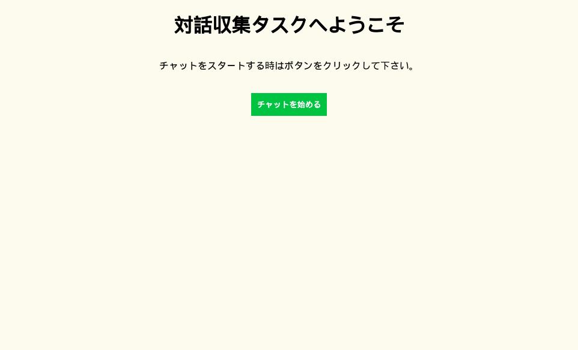
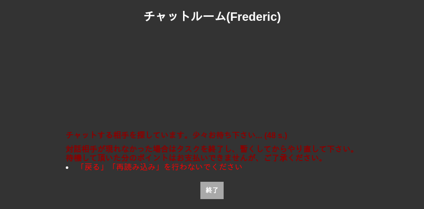

# Manual

## Introduction

The ChatCollectionFramework is a simple framework written in Python that allows quick instanciation of a chat server that can be used to collect chat data from crowdsourcing experiments.

It provides a default functional implementation of a Chat Server.   However, in most situations, the default implementation will not be enough.  It will be used only as a starting point.  Additional customizations will need to be implemented upon it to fulfill your specific requirements.

At this moment, the typical use case that is supported is a server to which clients can connect to to find a partner and where they can chat one on one.

Eventually, other use cases could be implemented.

To demonstrate how the framework can be used, we will create a custom implementation of the dummy chat server.

## Installation

Before installing the framework, let's prepare the working directory of our dummy chat server.

Let's make a directory in our home directory:

	cd
	mkdir my-custom-chat-server
	cd my-custom-chat-server

To prepare the Python environment of our project, we do:

	pipenv --python python3

That's it. We have now an empty project.

It's time to integrate the ChatCollectionFramework into our project.  Before we can do that, we must first build it from source.

As the framework is currently not public, you must download and install it into your home directory from this [git repository](https://bitbucket.org/ku_nlp/chatcollectionframework/src/master/) :

	cd
	git clone git@bitbucket.org:ku_nlp/chatcollectionframework.git chat-collection-framework
	cd chat-collection-framework
  
You might find additional Instructions in the _README.md_ file but essentially, to build the wheel file, you need to do that:

	pipenv sync
	pipenv shell
	rm -rf dist/*
	python setup.py clean --all 
	python setup.py sdist bdist_wheel

The third and fourth commands are not needed the very first time that you build the package.  However, they will be needed for ulterior builds.

At this point, you should have the chat_collection_framework-X.Y.Z-py3-none-any.whl in the dist directory.  This file needs to be installed in the Python environment of your specific project.

Let's do that.

	cd ~/my-custom-chat-server
	pipenv uninstall chat_collection_framework
	pipenv lock --clear
	pipenv install --clear ~/chat-collection-framework/dist/chat_collection_framework-X.Y.Z-py3-none-any.whl
	
The second line is only useful in the case that you have already installed the ChatCollectionFramework and that you want to uninstall it before reinstalling it in your project.  This might come handy if you need to modify the code of the ChatCollectionFramework.  That could be needed because the package is still in development and might need either bug fixes or new features.

 At this stage, the ChatCollectionFramework should be installed.  However, before we can use it, we need to configure a few elements.
 
 First, let's write a configuration file. To do that, we will use the provided sample configuration file:
 
 	cp ~/chat-collection-framework/config.json.sample config.json
 
 We should edit the config.json and replace all occurrences of ChatCollectionServer by my-custom-chat-server.
 
 Then, let's write a logging configuration file.  To do that, we will use the provided sample configuration file one more time:
 
	cp ~/chat-collection-framework/logging.conf.sample logging.conf
 
 The logging.conf file needs no modifications.  However, we need to create the log output directory so that it can work properly:
 
	 mkdir logs

The last step is to use the provided App.py.sample file as a starting point:

	cp ~/chat-collection-framework/App.py.sample App.py

You are now ready to start the server and check if it works.

	pipenv shell
	python App.py

For example, if you're running the server on the host basil501, launch a browser pointing to this page:

	http://basil501:8993/my-custom-chat-server/index

You should see something that looks like this:

If you set up the Nginx web server properly to that it redirects the requests from the my-custom-chat-server context to your server running on basil503, you should already be able to use the system with 2 different browsers and simulate a conversation between 2 users.  The configuration with Nginx web server is mandatory because the framework assumes that https is used and it will not work well without it.   The configuration of the Nginx server is out of scope of this document.  

When configured with Nginx, it should look like this:

## Customization

At this stage, we have a basic functional chat server but it needs to be customized to your specific requirements.  For example, most likely that the look must be changed. And possibly that some behavior must be different too.  In this section, we will explain different ways to modify the default behavior of the framework to fulfill your needs.

First, let's try to change the look of the welcoming page.

The framework assumes that the first page is called index.  Let's take a look at the framework code handling this request.

The entry points of the requests are defined in the class BaseApp that can be found in ~/chat-collection-framework/server/base.py:

	class BaseApp(Flask):
	
	    def __init__(self, import_name, api):
	        Flask.__init__(self, import_name)
	
	        my_loader = jinja2.ChoiceLoader([
	            self.jinja_loader,
	            jinja2.FileSystemLoader(os.path.join(sys.prefix, 'templates')),
	        ])
	        self.jinja_loader = my_loader
	
	        self.api = api
	        self.cfg = api.cfg
	        self.logger = api.logger
	
	        self.SESSION_TYPE = 'filesystem'
	        self.SESSION_COOKIE_NAME = 'CGISESSID'
	        self.SESSION_FILE_DIR = self.cfg['sessions']
	        self.SESSION_COOKIE_PATH = self.cfg['cookiePath']
	        self.SESSION_COOKIE_SECURE = True
	
	        self.config.from_object(self)
	        Session(self)
	
	        @self.route(f"/{self.cfg['web_context']}/static/<path:path>")
	        def get_static(path):
	            return self.get_static(path)
	
	        @self.route(f"/{self.cfg['web_context']}/default_static/<path:path>")
	        def get_default_static(path):
	            return self.get_default_static(path)
	
	        @self.route(f"/{self.cfg['web_context']}/version")
	        def version():
	            return self.version()
	
	        @self.route(f"/{self.cfg['web_context']}/index")
	        def index():
	            return self.index()
	
	        @self.route(f"/{self.cfg['web_context']}/admin")
	        def admin():
	            return self.admin()
	         
	        ... 
	           
	
A BaseApp is basically a Flask App that handles a predetermined set of requests.  The supported requests are:

- version: shows the version of the web application.
- index: shows the welcome page.
- admin: shows the administrator's page.
- join: add a user to a chatroom.
- chatroom: retrieve the state of a chatroom.
- post: add a new message to a chatroom.
- leave: remove a user from the chatroom.

As we can see, a route is declared for each request and a corresponding function is called.

In our case, for the index request, the default behavior looks like this:

 
	    def index(self):
	        try:
	            return render_template(template_name_or_list='index.html')
	        except TemplateNotFound:
	            return render_template(template_name_or_list='default_index.html')
	
As we can see, it tries first to render the index.html template page if it can find it. Otherwise, it will render the default_index.html template page that comes from the framework.

So if we just want to change the look of the index page, we should make a templates directory and copy the default_index.html into it with the name index.html:

	mkdir templates
	cp ~/chat-collection-framework/default_index.html templates/index.html

Let's edit the templates/index.html file and customize it a little bit.

The file should look something like this:

	<!DOCTYPE html>
	<html lang="ja">
	<head>
	    <meta charset="utf-8">
	    <title>チャットサーバー</title>
	    <link rel="stylesheet" href="default_static/default_style.css">
	    <link rel="stylesheet" href="static/style.css">
	    
	    <link rel="stylesheet" href="https://ajax.googleapis.com/ajax/libs/jqueryui/1.12.1/themes/smoothness/jquery-ui.css">
	    
	    
	    
	    
	</head>
	<body class="column">
	<h1>対話収集タスクへようこそ</h1>
	  
	
チャットをスタートする時はボトンをクリックして下さい。

	  
	<form id="form-join" action="join" method="POST">
	<input type="hidden" id="client-tab-id" name="clientTabId"/>
	</form>
	<input type="submit" id="join-chat" value="チャットを始める" class="button" form="form-join"/>
	

	</body>
	
As long as we keep the essential parts, that are, the form containing the join-chat button, the Javascript code that handles the event associated with the join-chat button, and the initialization of the clientTabId variable, it should work normally.

So it's possible to add some text, change the CSS attributes, alter the structure of the document and make it look as we want.  

We can see that by default, 2 CSS files are referred: 

- default_static/default_style.css
- static/style.css

The first contains the default CSS definitions.  The second one contains customized definitions that will be loaded on top of the default ones.  So if we want to reuse the default style, we can leave the first line and add a new file static/style.css to override some styles when needed.  In the case where a completely different style is desired, it's probably better to remove the first line and just use the second line.

If the changes are only visual, that should be enough.

However, if there are some changes in the behavior, some modifications on the server code will also be needed.   For example, let's say that we want to add mandatory values into the form that must be provided before joining the chat system.  We could add some client-side validations but we should also add some server-side validations as well.

Let's say that we want each user to provide their name before joining the chat, we could modify the original form and add a Name field like this:

	<form id="form-join" action="join" method="POST">
	名前：<input type="text" id="username" name="username"/>  
	
On the server-side, we will have to modify the join request handling so that the user-name parameter must be provided or return an 400 HTTP response if none is provided.

The recommended approach is to copy the code from the framework and adapt it to our needs.  There are usually 3 levels of changes:

- App
- Api
- Templates

Depending on the situation, not all levels need to be changed. The fewer changes, the better.

In our case, we want first to override the App.join() method.  The code can be found in ~/chat-collection-framework/server/base.py.  It looks like this:

    def join(self, session, request):
        if 'clientTabId' not in request.form:
            return '', 400

        client_tab_id = request.form['clientTabId']
        user_id = f'{session.sid}_{client_tab_id}'
        data = self.api.join(user_id)

        if isinstance(data, str) and data.startswith("Error: MultipleTabAccessForbidden"):
            return self.error_forbidden_access_multiple_tabs()

        try:
            return render_template(
                template_name_or_list='chatroom.html',
                client_tab_id=client_tab_id,
                msg_count_low=data['msg_count_low'],
                msg_count_high=data['msg_count_high'],
                poll_interval=data['poll_interval'],
                delay_for_partner=0 if data['chatroom'].closed else data['delay_for_partner'],
                experiment_id=data['chatroom'].experiment_id,
                chatroom_id=data['chatroom'].id,
                is_first_user=(data['chatroom'].initiator == user_id),
                server_url=''
            )
        except TemplateNotFound:
            return render_template(
                template_name_or_list='default_chatroom.html',
                client_tab_id=client_tab_id,
                msg_count_low=data['msg_count_low'],
                msg_count_high=data['msg_count_high'],
                poll_interval=data['poll_interval'],
                delay_for_partner=0 if data['chatroom'].closed else data['delay_for_partner'],
                experiment_id=data['chatroom'].experiment_id,
                chatroom_id=data['chatroom'].id,
                is_first_user=(data['chatroom'].initiator == user_id)
            )

Basically, it makes sure that the clientTabId is provided and it returns the chatroom.html page if it's defined or the default _chatroom.html if it's not.

We can copy the whole method into our App class and adjust it so that it tests if the mandatory username parameter is found or not.  Pass the username to the Api so that we can update our model accordingly and pass it too to our chatroom.html template so that it's shown to the user:

    class App(BaseApp):

	...
	
      def join(self, session, request):
        if 'clientTabId' not in request.form or 'username' not in request.form:
            return '', 400

        client_tab_id = request.form['clientTabId']
        user_id = f'{session.sid}_{client_tab_id}'
        username = request.form['username']
        attribs = {'username': username}
        data = self.api.join(user_id, attribs)

        if isinstance(data, str) and data.startswith("Error: MultipleTabAccessForbidden"):
            return self.error_forbidden_access_multiple_tabs()

        return render_template(
            template_name_or_list='chatroom.html',
            client_tab_id=client_tab_id,
            msg_count_low=data['msg_count_low'],
            msg_count_high=data['msg_count_high'],
            poll_interval=data['poll_interval'],
            delay_for_partner=0 if data['chatroom'].closed else data['delay_for_partner'],
            experiment_id=data['chatroom'].experiment_id,
            chatroom_id=data['chatroom'].id,
            is_first_user=(data['chatroom'].initiator == user_id),
            server_url='',
            username=username
        )

We removed the default_chatroom.html because we will need it no longer because our chatroom.html page needs to be customized anyway so that it shows the username.

Again to customize the chatroom.html, it's recommended to copy the default_chatroom.html page from the framework and adjust it to our needs:

	cp ~/chat-collection-framework/templates/default_chatroom.html templates/chatroom.html

And we adjust it a little bit to show the username in the header:

	<body class="column fixed-height">
	    <h2>チャットルーム({{username}})</h2>
	
That's it!

Let's start the server and see if our changes work properly:

	python App.py

The index page now looks like this:

And once that the チャットを始める button is clicked, the next page looks like this:

That's how you can customize the framework.

In our case, the changes were very simple.  Some major changes might be needed for some situations.  For more real examples, it's recommended to check the code of other existing projects that are using the ChatCollectionFramework.

As much as possible, it's recommended to try minimizing changes and try reusing code from the framework as much as possible.  For example, in some circumstances, it might be better to override an Api's method and call its super behavior instead of duplicating the code.  This way, if the framework is upgraded, it's more likely not to provoke bugs.  Of course, as the framework is still in development, it's possible that some non backward-compatible changes are introduced and that some fixes will need to be applied to our custom code.

Then we can edit the templates/index.html page and change it

By default, the page found in ~/chat-collection-framework/

## Troubleshooting

